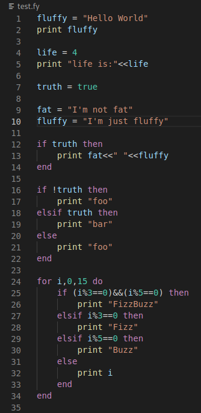

# Fluffy the Programming Language

Fluffy is a scripting language. It is an easy language and therefore the syntax style is closed to Lua. 
In order to keep a certain performance Fluffy is transpiled to C++.

> The goal of this project was to learn how to make a transpiler. In fact, this is the first attempt to create a programming language. 

Visit the github projetct: [fluffy the programming language](https://github.com/Matbabs/Fluffy)

## Features

* syntax-highlight

